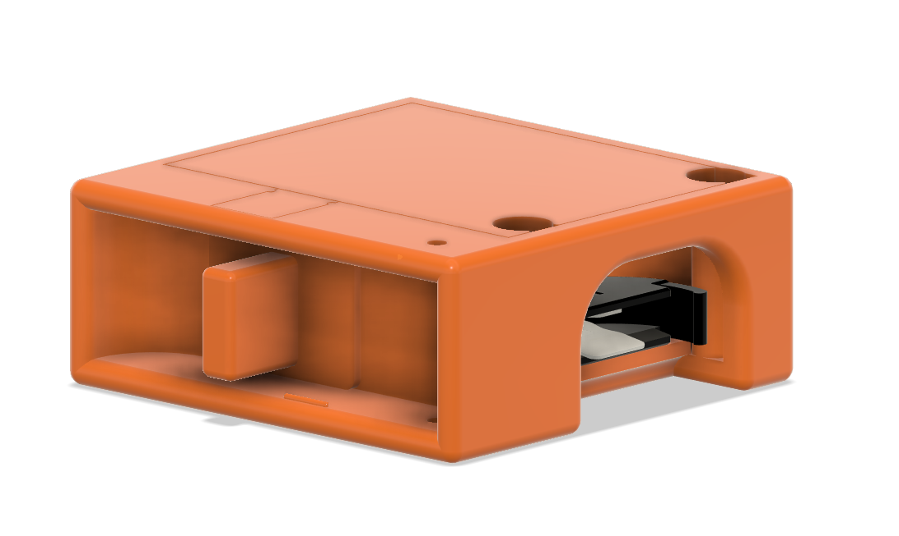
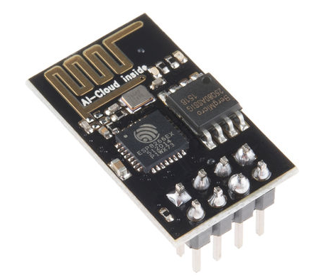
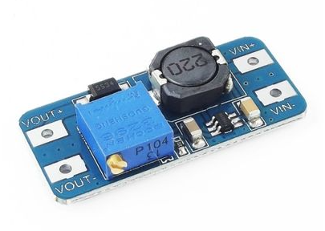
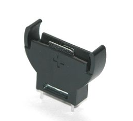
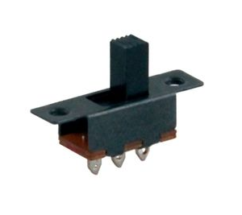
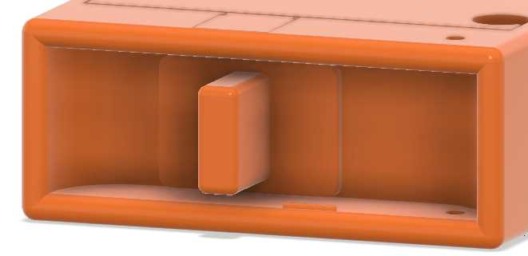
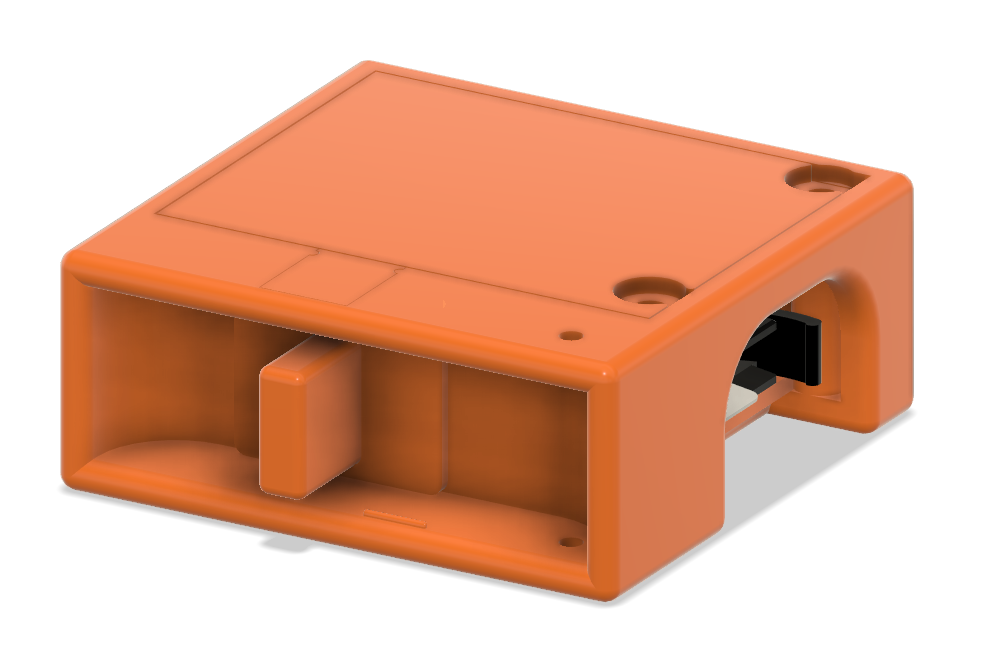
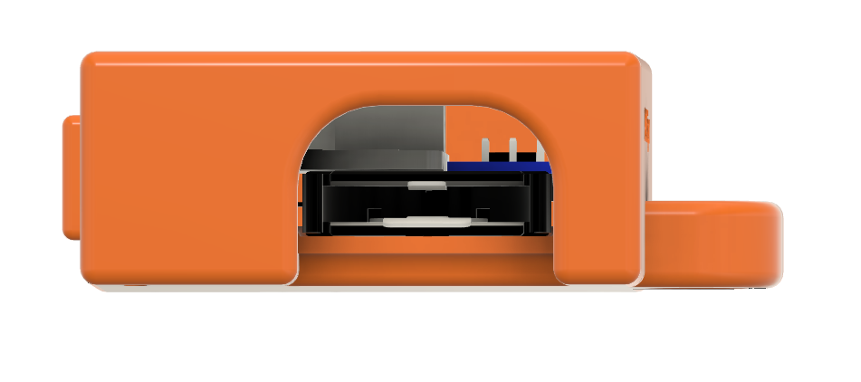

## The Story Behind The Lonesaver Device
My paternal grandmother lives alone. My two uncles reside in the same apartment building and see each other several times a day. Unfortunately, my grandmother fell off her sofa one day and was unable to get up. Her phone was in another room, so she couldn't call my uncles. She had to squirm on the ground for about an hour before she could gather the strength to get up. I was really upset when I heard this. Even though someone would spot her and help her in a few hours when they came by, this might have been a lot worse situation. I wanted to assist her and all of my elderly relatives who live alone. I also thought others might have the same issue and need something like this. 

## What Is The Lonesaver Device?
Lonesaver is a device designed to help elderly people who live alone. Accidents happen all the time, and if someone lives alone, the situation can quickly deteriorate. Elderly people may fall and be unable to get up. Sometimes they don't have their phones with them, or they aren't in a position to call or message emergency services or loved ones. I want to correct this condition with lonesaver. Except in wet situations, an elderly person will wear it around their neck at all times. When the user switches on the device, it sends a message to a specified help telegram group made up of nearby loved ones.

## How It Works
The device transmits a message to a telegram group at predefined intervals. A portal can be used to change the message and the message interval. The WIFI SSID and password will be entered here. It sends messages via the Telegram API. 
The device does not require charging. It is powered by a CR2030 3v single-use battery that is only engaged when the switch is pressed. This way, the elderly don't have to worry about charging it, and their loved ones don't have to worry about grandma or grandpa forgetting to charge it.  

### The WIFI Credentials And Message Editing Portal
When you connect your cell phone or any other WIFI capable device, you will be able to access this portal. Connect to the 'lonesaver' WIFI network and enter the password 'thereisnospoon' as the WIFI password. After that, you should be able to access the portal using the http://192.168.1.4 address. This may change depending on your WIFI settings, therefore I recommend connecting a USB TTL converter and inspecting the serial output to determine where it is.

Here you can modify the WIFI SSID and password. After that, you'll need to restart the device. You can also modify the message that will be sent as well as the interval in seconds. 

It is currently in Turkish, but you can change it using the code. 

## What You Will Need
- ESP8266-ESP01 WIFI module

- MT3608 adjustable DC/DC boost converter module

- Upright CR2032 battery holder

- Sliding ON/OFF switch

- 3 mm led diode

- A 3D printer to print the parts. If you don't have access to one, you can find a friend or online services to print it for you.

## Design Considerations

### Switch
I wanted the design to be large to accommodate my grandmother's demands. It had to have a large enough switch to accommodate her fingertips, but it couldn't be too easy to trigger by accident. As a result, I decided to place the switch inside a shroud-like structure. This prevented it from being grabbed by clothing or accidently activating.

### Power
Even young people often forget to charge their devices. So expecting elderly people to remember wouldn't be logical. I needed my design to function without having to be charged. First, I thought about the deep sleep function on the ESP8266. But even if I used that, it would still use too much power. So the simplest way became the best. Just connecting a sliding switch to the ESP. It won't use any power at all unless it is needed. It can connect to the internet and start sending messages in less than 30 seconds. The battery would need to be changed every year just in case.

### Feedback
Even teenagers frequently forget to charge their smartphones. As a result, expecting elderly individuals to remember is illogical. I needed my design to work without being charged. First, I considered the ESP8266's deep sleep function. Even if I did that, it would still consume too much electricity. As a result, the simplest solution became the best. Simply connect a sliding switch to the ESP. It will not use any power unless it is required. In less than 30 seconds, it can connect to the internet and begin transmitting messages. Every year, just in case, the battery would need to be replaced.

### Some Pictures Of The Device
I wanted to include the devices I already built but they were being used by my grandmothers. So I will share some of the CAD pictures. They look better anyway.

